# TP4 - Bases de Datos y Manejo de Versiones

## Información
- Instituto Tecnológico de Buenos Aires
- Departamento de Ciencias de la Vida
- Bioingeniería
- 16.22 - Informática Médica

## Profesores
- Carlos Lazzarino  
- Ingrid Spessotti  
- Eugenia Camila Berrino  
- Melina Piacentino Castaño  
- Auxiliar: Valentina Medina Santinon

## Alumnas
- Camila Noemí Pereira
- Zarina Cristal Scalise  

## Fecha de entrega
26/05/2025

---

# Parte 1: Bases de datos

### 1. Clasificación de la base de datos

La base de datos que plantea la consigna es una base de datos relacional, puesto a que la información que contiene se organiza en tablas relacionadas entre sí por el uso de claves primarias y foráneas. Se la puede clasificar como transaccional y operativa ya que está pensada para el registro de operaciones diarias del centro médico. Es decir, contiene información sobre las consultas de los profesionales, las recetas emitidas, datos de los pacientes, entre otras. Su orientación apunta a la gestión de información con el fin de facilitar las búsquedas realizadas en el centro, pudiendo integrar historiales clínicos, turnos y recetas electrónicas.

### 2. Diagrama de Entidades y Relaciones

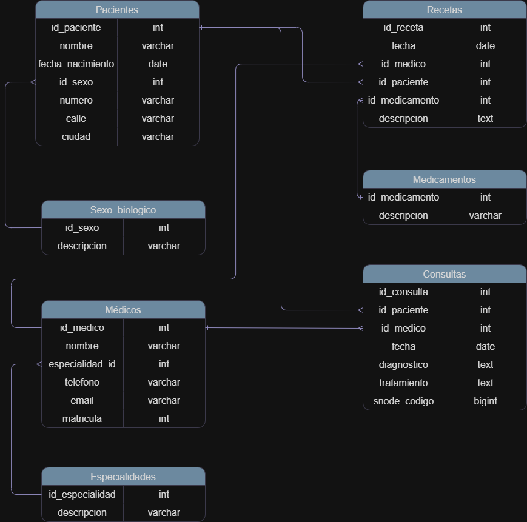

### 3. Modelo relacional

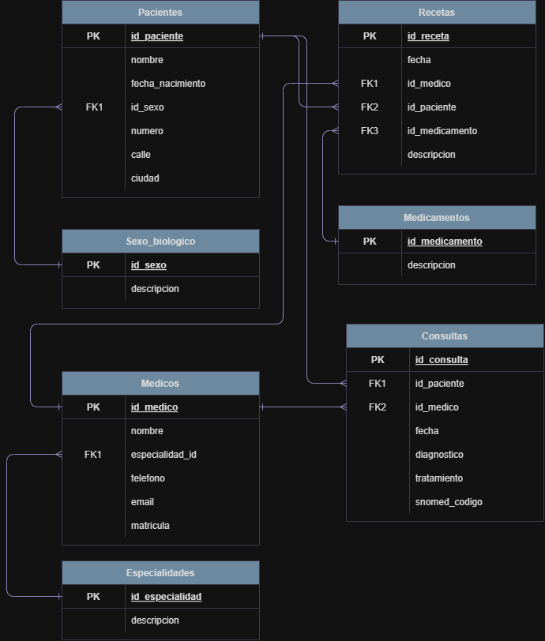

### 4. ¿Está normalizada?

La base no se considera que esté del todo normalizada pues hay algunas cosas que podrían mejorarse o separarse más. Por ejemplo, en la tabla de médicos, hay datos como el nombre, especialidad, teléfono, mail y matrícula todos juntos. Quizás podría separarse en dos tablas distintas: una con la información básica del médico (nombre y matrícula) y otra con sus datos de contacto, así no se repite si un médico trabaja en más de un lugar. También podría pensarse en sacar los datos de la dirección de los pacientes (calle, número, ciudad) a otra tabla aparte, especialmente si muchos pacientes viven en la misma ciudad, para evitar repetir siempre lo mismo. Entonces, si se quisiera normalizar la base, lo que se haría sería revisar qué datos se repiten seguido y separarlos en tablas nuevas, relacionadas por ID. Esto ayudaría a tener todo más ordenado, evitar errores si hay que actualizar algún dato, y hacer más fácil el mantenimiento general de la base.

---

# Parte 2: Consultas SQL

A continuación se presentan las consultas SQL junto a capturas de pantalla del resultado de cada una.

---

## Consulta 01

[Ver archivo 01_InfoMed_TP4_ScalisePereira.sql](./01_InfoMed_TP4_ScalisePereira.sql)

**Resultado esperado:**  

---

## Consulta 02

[Ver archivo 02_InfoMed_TP4_ScalisePereira.sql](./02_InfoMed_TP4_ScalisePereira.sql)

**Resultado esperado:**  
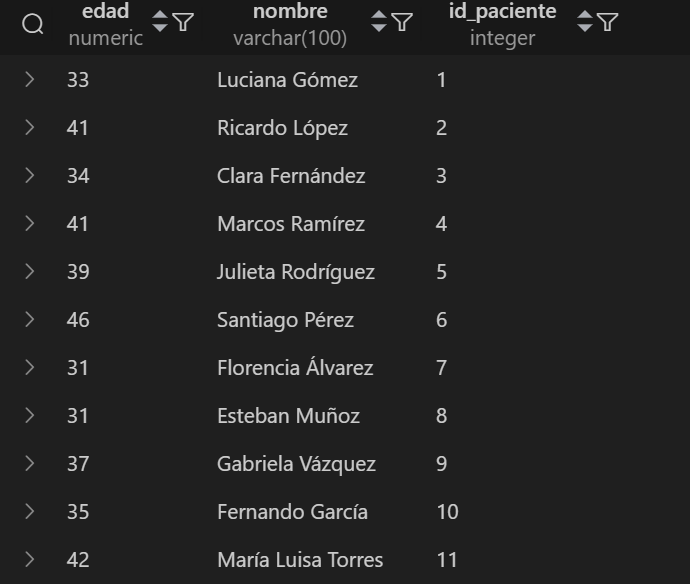  
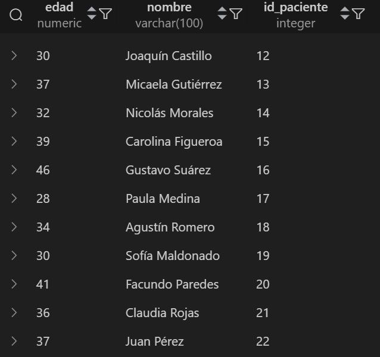  

---

## Consulta 03

[Ver archivo 03_InfoMed_TP4_ScalisePereira.sql](./03_InfoMed_TP4_ScalisePereira.sql)

**Resultado esperado:**  
  

---

## Consulta 04

[Ver archivo 04_InfoMed_TP4_ScalisePereira.sql](./04_InfoMed_TP4_ScalisePereira.sql)

**Resultado esperado:**  
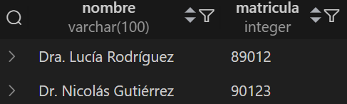

---

## Consulta 05

[Ver archivo 05_InfoMed_TP4_ScalisePereira.sql](./05_InfoMed_TP4_ScalisePereira.sql)

**Resultado esperado:**  
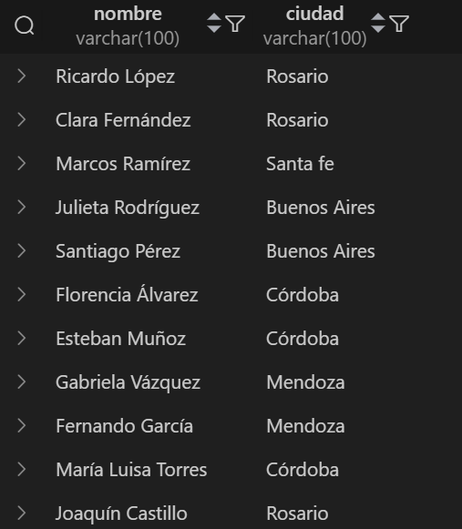  
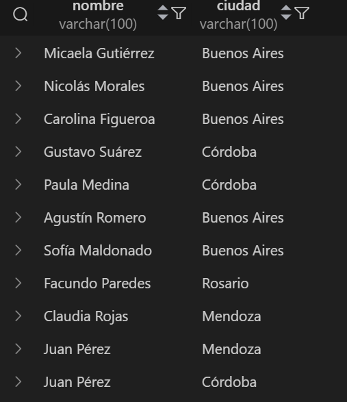

---

## Consulta 06

[Ver archivo 06_InfoMed_TP4_ScalisePereira.sql](./06_InfoMed_TP4_ScalisePereira.sql)

**Resultado esperado:**  
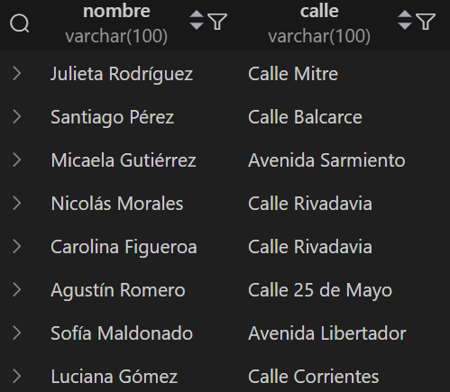

---

## Consulta 07

[Ver archivo 07_InfoMed_TP4_ScalisePereira.sql](./07_InfoMed_TP4_ScalisePereira.sql)

**Resultado esperado:**  
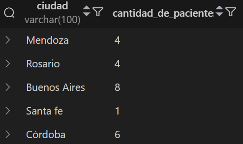

---

## Consulta 08

[Ver archivo 08_InfoMed_TP4_ScalisePereira.sql](./08_InfoMed_TP4_ScalisePereira.sql)

**Resultado esperado:**  
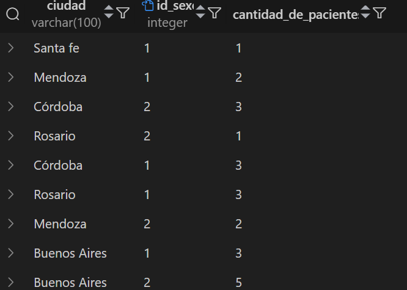

---

## Consulta 09

[Ver archivo 09_InfoMed_TP4_ScalisePereira.sql](./09_InfoMed_TP4_ScalisePereira.sql)

**Resultado esperado:**  
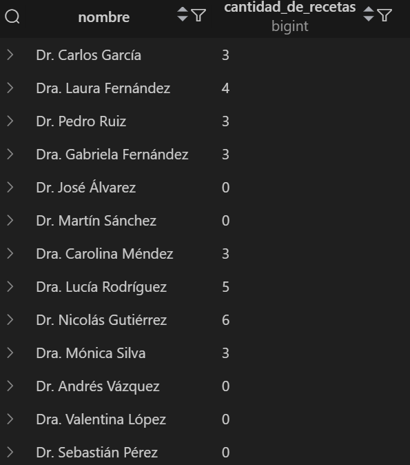  
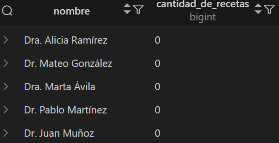

---

## Consulta 10

[Ver archivo 10_InfoMed_TP4_ScalisePereira.sql](./10_InfoMed_TP4_ScalisePereira.sql)

**Resultado esperado:**  
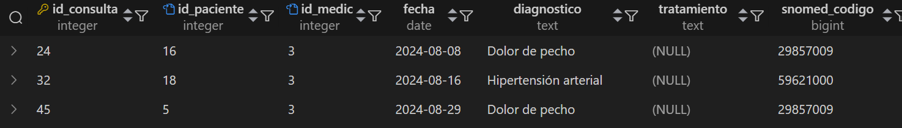

---

## Consulta 11

[Ver archivo 11_InfoMed_TP4_ScalisePereira.sql](./11_InfoMed_TP4_ScalisePereira.sql)

**Resultado esperado:**  
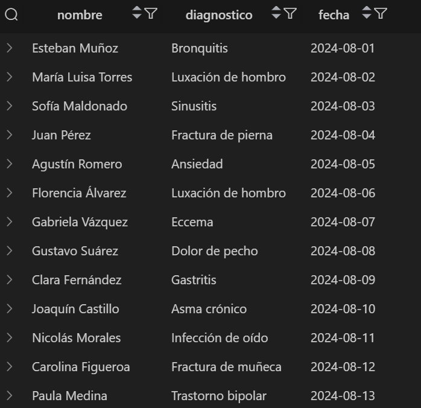  
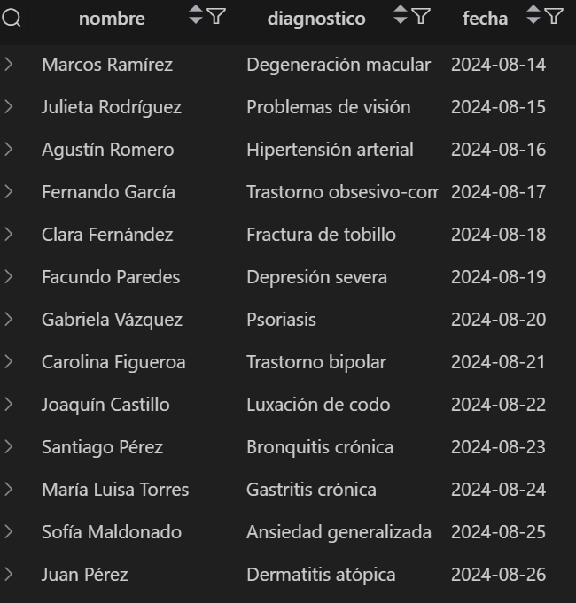  
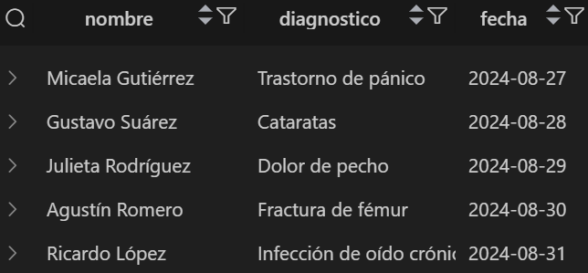

---

## Consulta 12

[Ver archivo 12_InfoMed_TP4_ScalisePereira.sql](./12_InfoMed_TP4_ScalisePereira.sql)

**Resultado esperado:**  

---

## Consulta 13

[Ver archivo 13_InfoMed_TP4_ScalisePereira.sql](./13_InfoMed_TP4_ScalisePereira.sql)

**Resultado esperado:**  
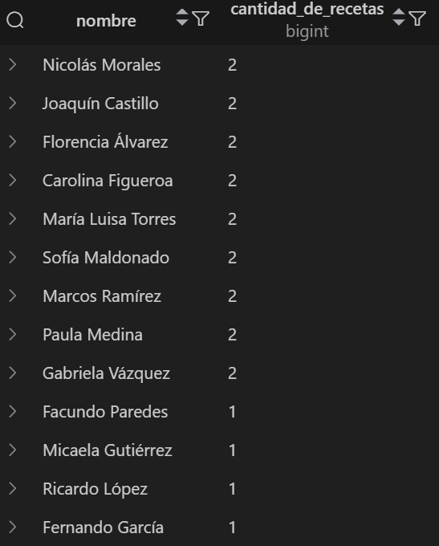  
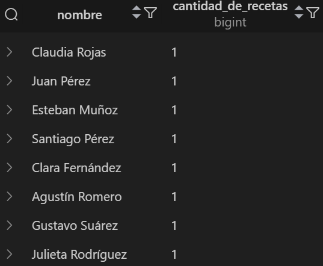

---

## Consulta 14

[Ver archivo 14_InfoMed_TP4_ScalisePereira.sql](./14_InfoMed_TP4_ScalisePereira.sql)

**Resultado esperado:**  

---

## Consulta 15

[Ver archivo 15_InfoMed_TP4_ScalisePereira.sql](./15_InfoMed_TP4_ScalisePereira.sql)

**Resultado esperado:**  
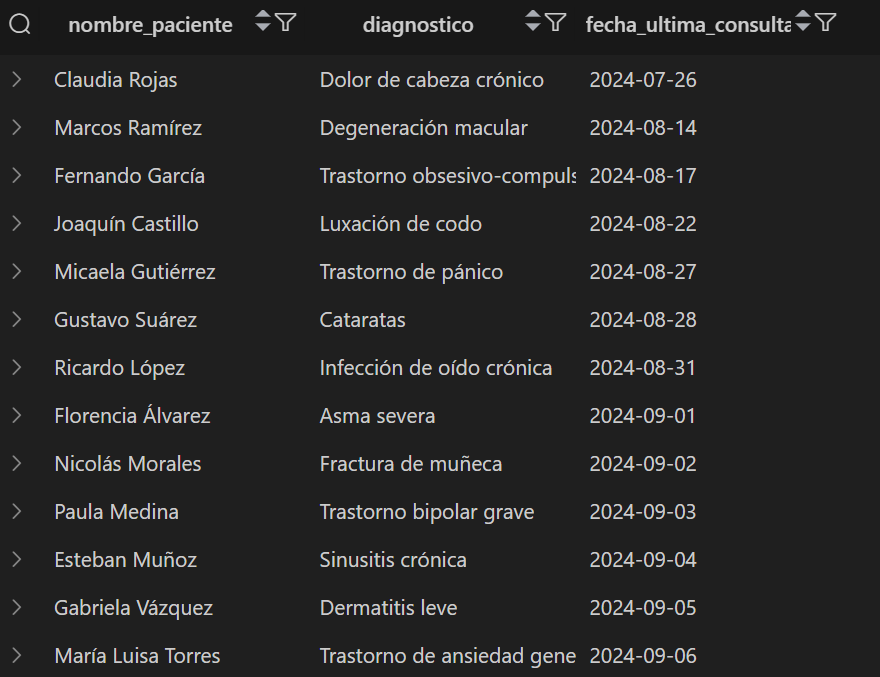  

---

## Consulta 16

[Ver archivo 16_InfoMed_TP4_ScalisePereira.sql](./16_InfoMed_TP4_ScalisePereira.sql)

**Resultado esperado:**  
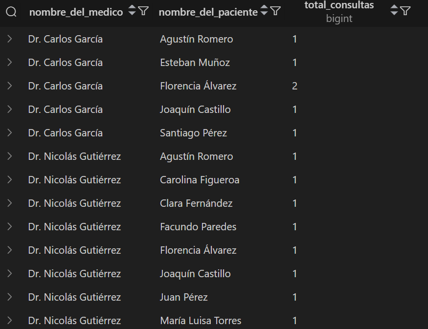  
  
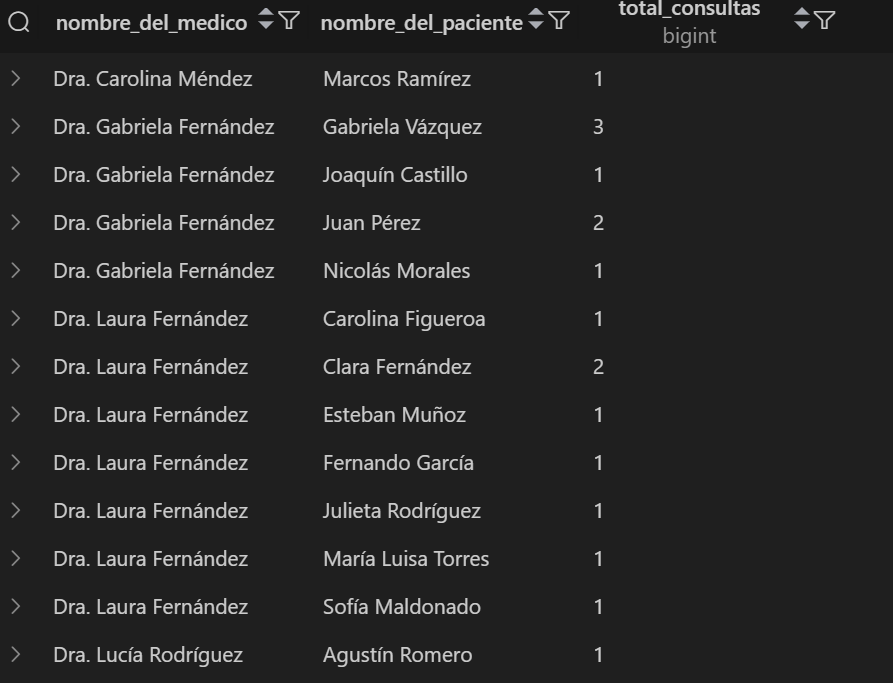  
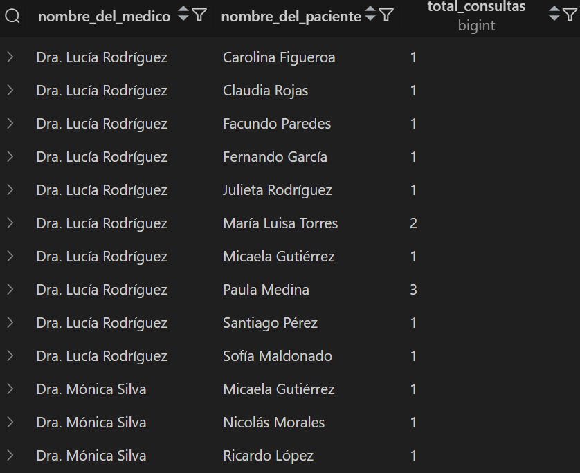  

---

## Consulta 17

[Ver archivo 17_InfoMed_TP4_ScalisePereira.sql](./17_InfoMed_TP4_ScalisePereira.sql)

**Resultado esperado:**  
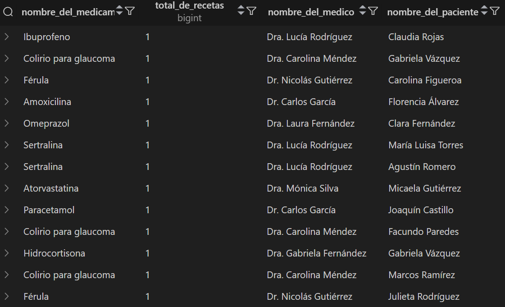  
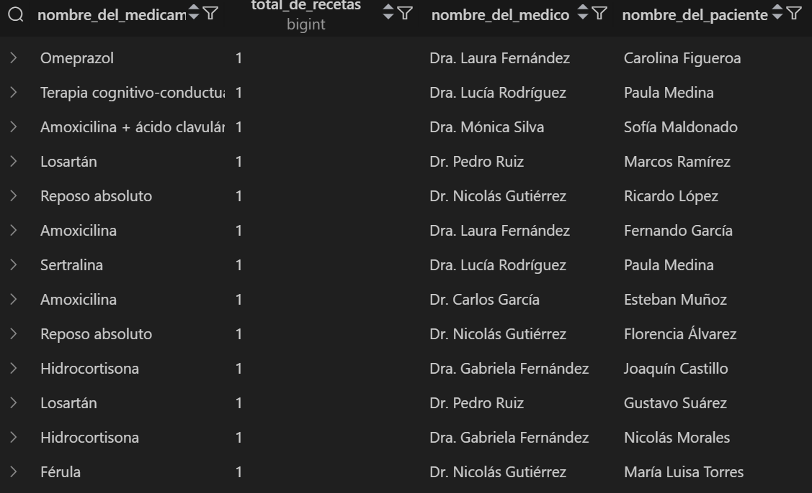  
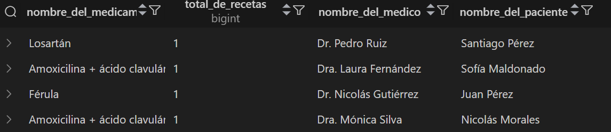

---

## Consulta 18

[Ver archivo 18_InfoMed_TP4_ScalisePereira.sql](./18_InfoMed_TP4_ScalisePereira.sql)

**Resultado esperado:**  
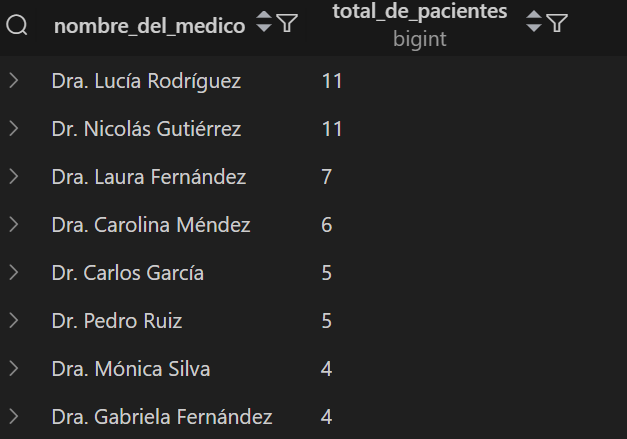
